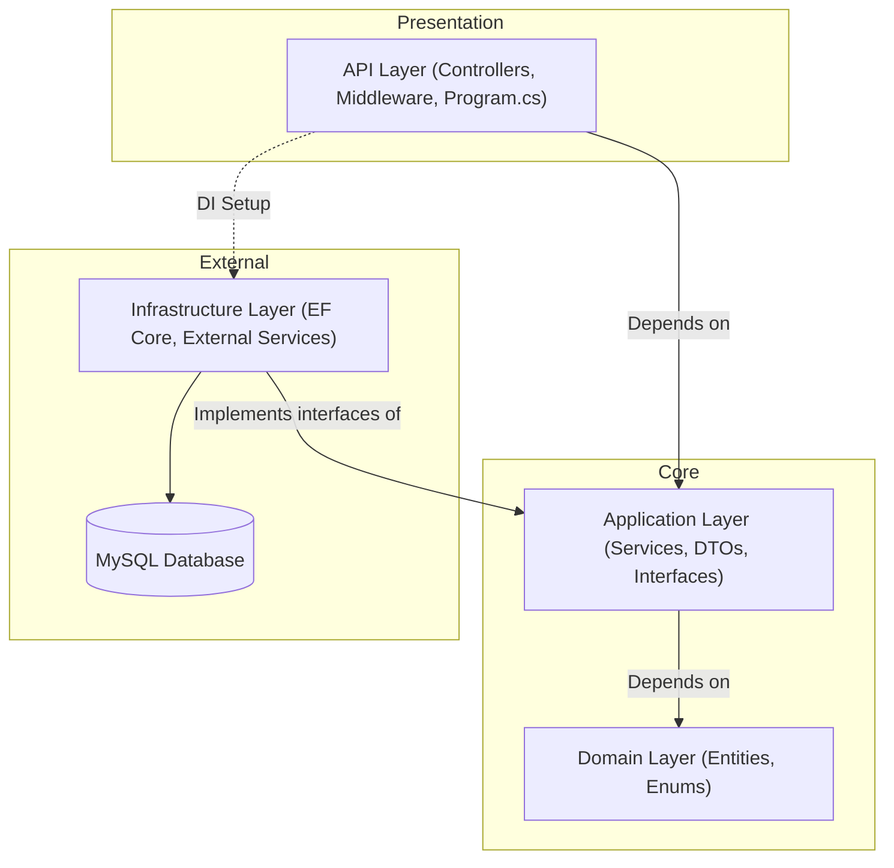

# ASP.NET Backend Documentation

This document outlines everything we used and everything we implemented in the ASP.NET backend application.

## 1. Architecture & Core Technologies
- **Framework**: .NET 10.0 (`net10.0`) Web API.
- **Architecture**: **Clean Architecture** (divided into `API`, `Application`, `Domain`, and `Infrastructure` layers).

- **Database**: MySQL integrated via **Entity Framework Core 9.0** (`Pomelo.EntityFrameworkCore.MySql`).
- **Environment Management**: `DotNetEnv` for loading configuration from `.env` files.
- **Documentation**: Swagger / OpenAPI (`Swashbuckle.AspNetCore`) for interactive API testing.

## 2. Authentication & Security Libraries
- **JWT**: `Microsoft.AspNetCore.Authentication.JwtBearer` for validating Access Tokens.
- **Hashing**: `BCrypt.Net-Next` for securely hashing passwords.
- **Caching**: ASP.NET Core `MemoryCache` (`AddMemoryCache()`) utilized for temporary state (like 2FA temp tokens).
- **CORS**: Configured Cross-Origin Resource Sharing to allow credentials (cookies) and specific client URLs.

## 3. Features & Flows Implemented

### Registration & Email Verification
- Users register and are assigned a `PENDING_VERIFICATION` status.
- The system generates a cryptographically secure token, hashes it for database storage, and emails the raw token.
- Validating the token upgrades the user to `PENDING_APPROVAL`.

### Login & Session Management
- Validates credentials and checks account status (e.g., Suspended, Inactive).
- Issues a short-lived **JWT Access Token** (via Header or HttpOnly Cookie) and a long-lived **Refresh Token**.
- **Token Rotation & Theft Detection**: Refresh tokens are rotated on use. If a previously used (revoked) refresh token is presented, the system detects a potential token theft and immediately revokes the entire token family (all active sessions for that user).

### Two-Factor Authentication (2FA)
- Full TOTP (Time-based One-Time Password) setup.
- If 2FA is enabled, login issues a temporary token instead of access tokens. The user must submit the TOTP code to complete login.
- Features to setup, enable, and disable 2FA.

### Password Management
- **Forgot Password**: Generates a secure, time-limited reset token sent via email.
- **Reset Password**: Consumes the token, updates the hashed password, and automatically revokes all existing sessions to secure the account.

### OAuth / Social Login
- Endpoints to handle OAuth callbacks, verifying codes and issuing application-specific JWTs or temporary tokens if 2FA is required.

### Admin & User Management
- Controllers available for administrators to manage users (e.g., approving accounts) and for users to retrieve their own profiles.
