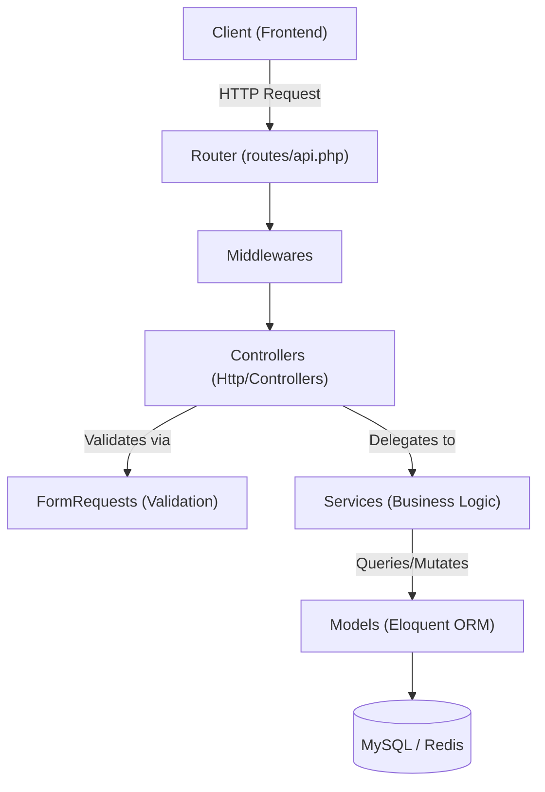
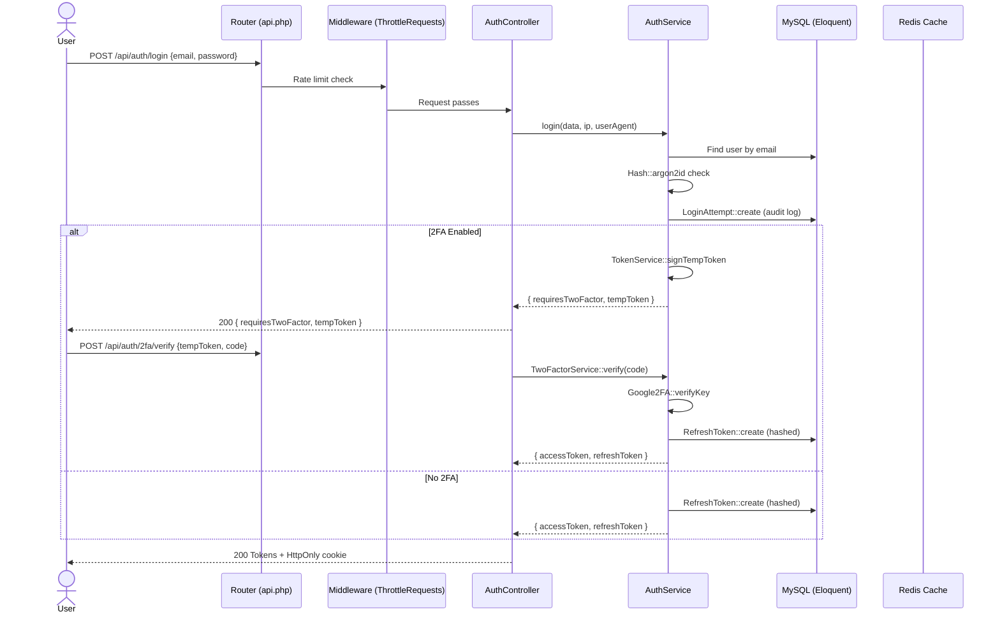
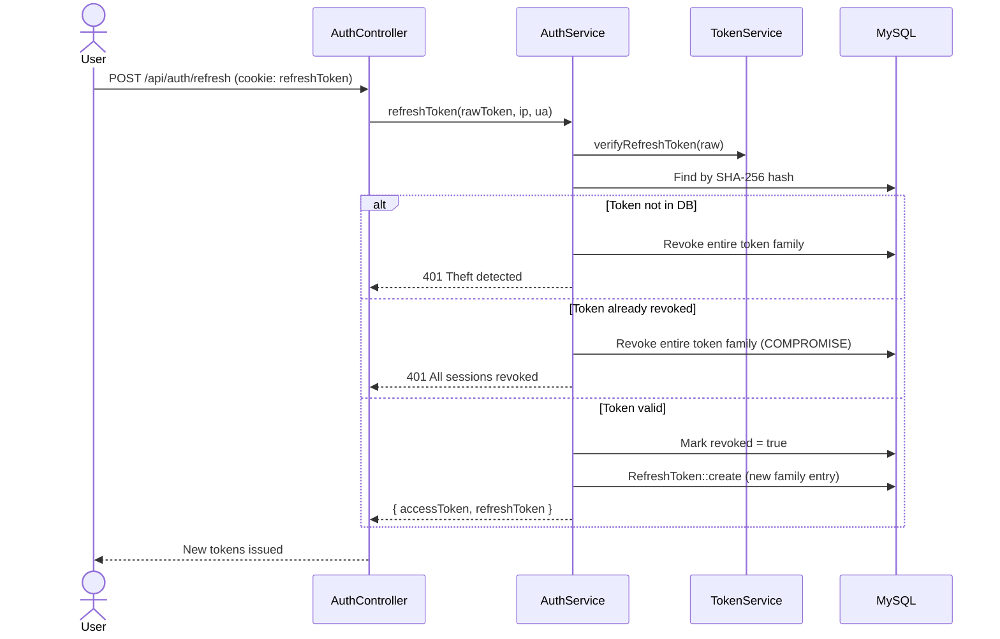
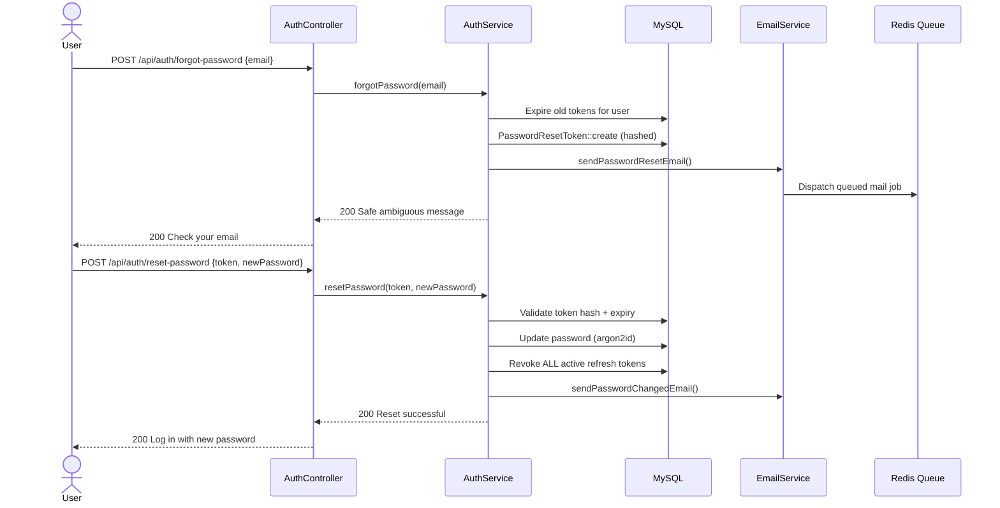
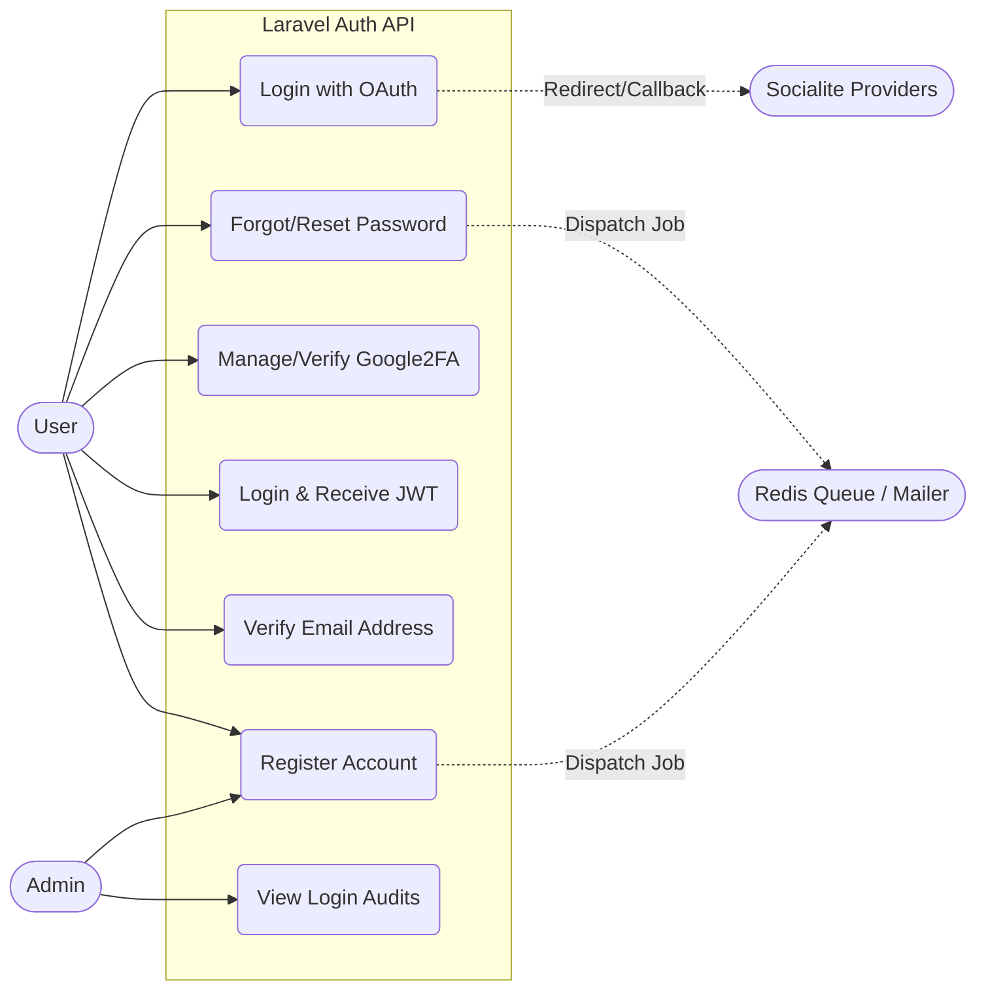

# Laravel Backend Documentation

This document outlines everything we used and everything we implemented in the Laravel backend API.

## 1. Architecture & Core Technologies
- **Framework**: Laravel 13.x (running on PHP 8.3+).
- **Architecture**: Laravel MVC structure strictly adhering to API best practices (FormRequests for validation, Service classes for business logic).

- **Database**: Eloquent ORM with migrations for schema management.
- **Caching & Queues**: `predis/predis` to utilize Redis for high-performance caching and job queuing.
- **Code Quality**: Laravel Pint, Pest/PHPUnit.

## 2. Authentication & Security Libraries
- **JWT**: `tymon/jwt-auth` for creating and verifying JSON Web Tokens.
- **OAuth**: `laravel/socialite` for seamless integration with social providers.
- **2FA**: `pragmarx/google2fa-laravel` for TOTP logic and `bacon/bacon-qr-code` for generating scannable QR codes.
- **Hashing**: Laravel's built-in `Hash::driver('argon2id')` for memory-hard password hashing.

## 3. Features & Flows Implemented

### Registration & Email Verification
- FormRequests handle strict validation (uniqueness, strength).
- Argon2id password hashing.
- Generates a secure token (hashed in DB) and triggers the EmailService to send a verification link.

### Login, Auditing & Session Management
- **Login Auditing**: Every login attempt (success or failure) is logged with the IP address and failure reason (e.g., invalid credentials, suspended).
- **Access & Refresh Tokens**: Issues a JWT access token and a custom refresh token.
- **Token Rotation & Theft Detection**: Refresh tokens are rotated. Reusing a revoked token triggers a "compromise signal," instantly revoking the user's entire token family (invalidating all sessions).

### Two-Factor Authentication (2FA)
- Generates a secret and QR code for Google Authenticator.
- Intercepts login to require a TOTP code if 2FA is enabled.
- Includes endpoints to verify and fully enable/disable 2FA.

### Password Reset Flow
- Generates time-limited reset tokens.
- Securely processes the reset, updates the password, and instantly revokes all active refresh tokens for security.
- Triggers a "Password Changed" confirmation email.

### External Communications
- Dedicated `EmailService` and `SmsService` classes to handle transactional notifications.

## 4. Sequence Diagrams

### Login Flow (with Audit Logging & optional 2FA)

### Token Rotation & Compromise Detection

### Password Reset Flow

## 5. Use Case Diagram

The following diagram illustrates the primary use cases and actors interacting with the Laravel backend.

