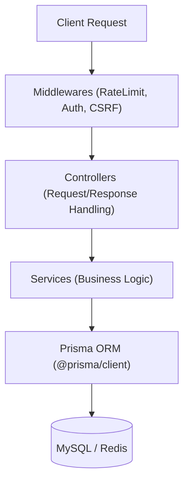
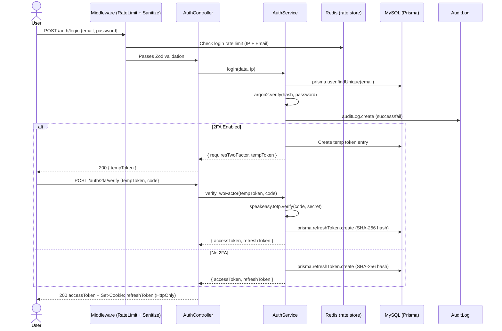
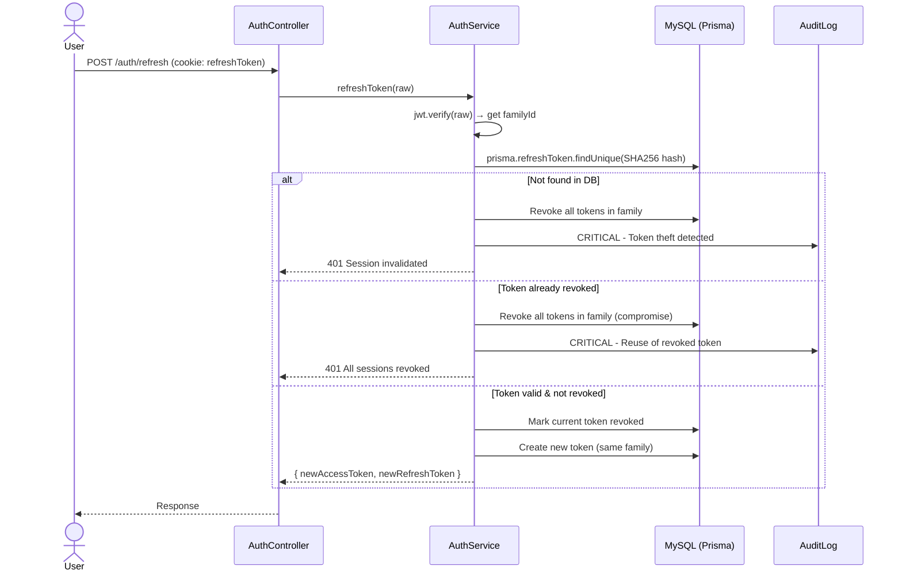
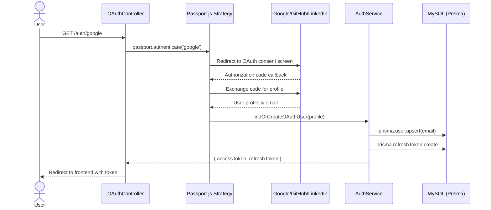
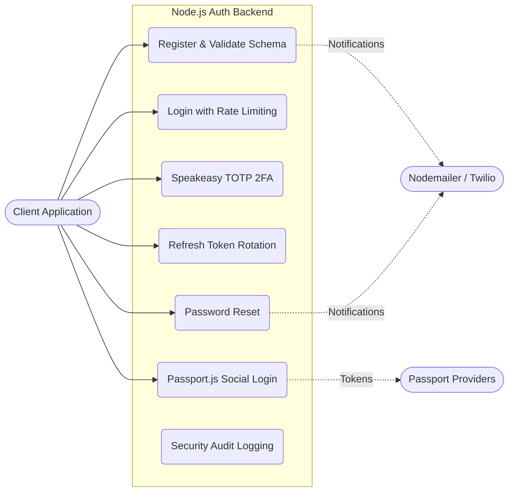

# Node.js Backend Documentation

This document outlines everything we used and everything we implemented in the Node.js backend application.

## 1. Architecture & Core Technologies
- **Runtime & Framework**: Node.js 20+ with Express.js (`express`).
- **Language**: Strictly typed **TypeScript**.
- **Architecture**: **Layered Architecture / MVC**. The codebase is modularized into `Controllers` (handling request/response logic), `Services` (encapsulating core business logic), and `Middlewares` (handling cross-cutting concerns like validation and authentication).

- **Database**: MySQL integrated using **Prisma ORM** (`@prisma/client`, `prisma`) for type-safe queries and schema migrations.
- **Caching**: **Redis** (`ioredis`) for storing rate limit data and fast temporary access.

## 2. Security & Hardening Libraries
- **Rate Limiting**: `express-rate-limit` and `rate-limit-redis` (distributed rate limiting).
- **Payload & HTTP Security**: `helmet` (security headers), `xss` (payload sanitization to prevent Cross-Site Scripting), and `csrf-csrf` (Double-Submit Cookie pattern).
- **Validation**: `zod` for rigorous runtime schema validation and end-to-end type safety.
- **Password Hashing**: `argon2` for memory-hard GPU-resistant hashing.

## 3. Authentication & Communication Libraries
- **JWT**: `jsonwebtoken` for stateless access tokens.
- **OAuth**: `passport`, `passport-google-oauth20`, `passport-github2`, `passport-linkedin-oauth2`.
- **2FA**: `speakeasy` (TOTP generation/validation) and `qrcode` (image generation).
- **Messaging**: `nodemailer` (emails), `twilio` & `africastalking` (SMS).

## 4. Features & Flows Implemented

### Registration & Validation
- Zod schemas validate all inputs.
- Passwords hashed via Argon2id.
- Issues secure email verification links.

### Secure Session Management
- **Short-lived Access Tokens** (15m, stateless JWTs) and **Long-lived Refresh Tokens** (7d, stateful, stored as SHA-256 hashes in the DB).
- **Theft Detection & Token Families**: Implemented token family tracking. If an attacker reuses a revoked refresh token, the system detects the theft and instantly invalidates the entire session family for that user.
- **Distributed Rate Limiting**: Specific, strict rate limits for login attempts (by IP and Email) to prevent brute-force attacks.

### Two-Factor Authentication (2FA)
- Generates TOTP secrets and QR codes.
- Login flow is intercepted if 2FA is active; requires the user to input their authenticator code before issuing the final access/refresh tokens.

### Password Management
- Forgot password endpoint generates secure reset links.
- Password reset endpoint requires the token, hashes the new password, and invalidates all existing sessions.
- Strict rate limits applied specifically to password reset endpoints to prevent spam.

### OAuth Integrations
- Full callback handling for Google, GitHub, and LinkedIn.
- Automatically creates accounts or links social profiles to existing accounts.

### Audit Logging
- Immutable, append-only logs for all major security events (logins, password resets, token revocations).

## 4. Sequence Diagrams

### Login Flow (with Rate Limiting & optional 2FA)

### Token Family Tracking & Theft Detection

### OAuth Flow (Passport.js)

## 5. Use Case Diagram

The following diagram illustrates the primary use cases and actors interacting with the Node.js backend.

